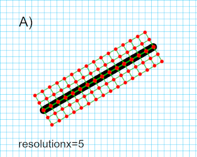

[[req_edr_resolutionx-response]]
==== *Requirement {counter:req-id}: /req/edr/resolutionx-response* Parameter resolutionx response
[width="90%",cols="2,6a"]
|===
^|A | If the `resolutionx` parameter is provided, it denotes the number of intervals to retrieve data for along the width of the corridor path including it’s minimum and maximum width coordinates.

^|B | A `resolutionx` value of 0 MUST return all available data at the native x resolution between (and including) the minimum and maximum coordinates of the defined corridor.  

image::../../images/REQ_rc-resolutionx-b.png[native resolution corridor example]

^|C | IF `resolutionx` is not specified the API SHOULD return all available data at the optimal resolution is determined by the server itself including the minimum and maximum coordinates of the defined corridor.  
|===

[source,java]
----
resolutionx = number of intervals
----

