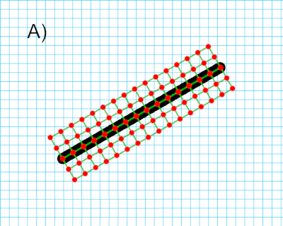
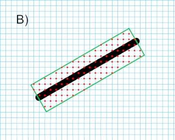

[[req_edr_resolutionz-response]]
==== *Requirement {counter:req-id}: /req/edr/resolutionz-response* Parameter resolutionz response
[width="90%",cols="2,6a"]
|===
^|A | If the `resolutionz` parameter is provided, it denotes the number of positions to retrieve data for, over the depth of the corridor path including its minimum and maximum width coordinates.

^|B | A `resolutionz` value of 0 SHALL return all available data at the stored vertical resolution between (and including) the minimum and maximum coordinates of the defined corridor.  

^|C | If `resolutionz` is not specified the API SHOULD return all available data at a resolution determined by the server, including the minimum and maximum coordinates of the defined corridor.  

[source,java]
----
resolutionz = number of intervals + 1
----
|===
